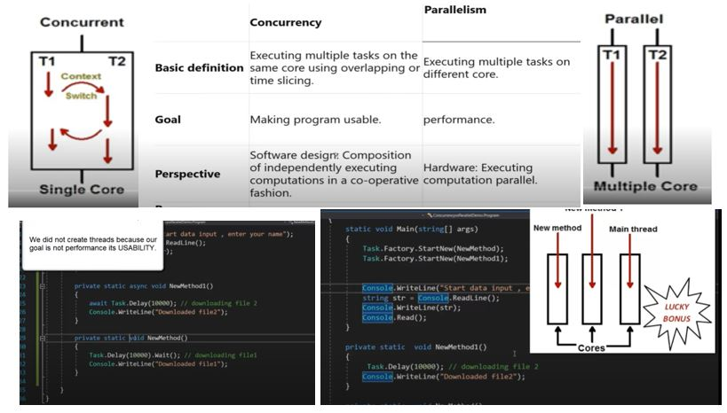

[Dotnet commands](https://github.com/loyolastalin/CLI_Linux/blob/master/donet-ubuntu.md)

dotnet build . /p:StartupObject=cApp1.Synchronus
dotnet run

dotnet build . /p:StartupObject=cApp1.Concurrency_Model
dotnet run

dotnet build . /p:StartupObject=cApp1.Parallel_Model
dotnet run

